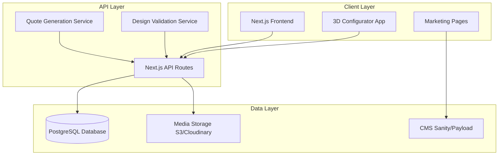

# Design Document

## Overview

This design document outlines the technical architecture and implementation approach for the Extreme V website redesign. The solution combines a modern, content-rich marketing website with an advanced 3D product configurator, inspired by CedarWorks' successful D2C model while tailored to Extreme V's brand and market position.

### Design Philosophy

The website will embody three core principles:
1. **Visual Excellence**: High-quality imagery and 3D visualization as the primary communication tool
2. **Simplified Complexity**: Making custom playground design accessible through intuitive interfaces
3. **Trust Through Transparency**: Clear communication of quality, safety, and value at every touchpoint

### Technology Stack

**Frontend:**
- Next.js 14+ (React framework with App Router for optimal performance and SEO)
- TypeScript (type safety and developer experience)
- Tailwind CSS (utility-first styling with custom design system)
- Three.js / React Three Fiber (3D visualization engine)
- Framer Motion (animations and transitions)

**Backend & Infrastructure:**
- Next.js API Routes (serverless functions for backend logic)
- Vercel (hosting, edge functions, and CDN)
- PostgreSQL (relational database for products, users, designs)
- Prisma (type-safe ORM)
- AWS S3 or Cloudinary (media asset storage and optimization)

**CMS & Admin:**
- Sanity.io or Payload CMS (headless CMS for content management)
- Custom admin dashboard for configurator component management

**Authentication & Email:**
- NextAuth.js (user authentication)
- Resend or SendGrid (transactional emails for quotes and notifications)

### Visual Design System

**Color Palette:**
Inspired by CedarWorks' nature-themed, family-friendly aesthetic:

```typescript
const colorSystem = {
  primary: {
    50: '#f0f9f4',   // Very light green
    100: '#dcf3e6',  // Light green
    500: '#10b981',  // Main brand green
    600: '#059669',  // Darker green
    700: '#047857',  // Deep green
  },
  secondary: {
    50: '#fef3e2',   // Soft cream
    100: '#fde8c4',  // Light peach
    500: '#f59e0b',  // Warm amber
    600: '#d97706',  // Deep amber
  },
  accent: {
    sky: '#7dd3fc',    // Soft sky blue
    coral: '#fb7185',  // Playful coral
    lavender: '#c4b5fd', // Gentle lavender
  },
  neutral: {
    50: '#fafafa',   // Off-white
    100: '#f5f5f5',  // Light gray
    200: '#e5e5e5',  // Border gray
    500: '#737373',  // Text gray
    700: '#404040',  // Dark text
    900: '#171717',  // Heading text
  }
};
```

**Typography:**
```typescript
const typography = {
  fonts: {
    heading: '"Inter", "SF Pro Display", system-ui, sans-serif',
    body: '"Inter", system-ui, sans-serif',
  },
  sizes: {
    hero: 'clamp(2.5rem, 5vw, 4rem)',      // 40-64px
    h1: 'clamp(2rem, 4vw, 3rem)',          // 32-48px
    h2: 'clamp(1.5rem, 3vw, 2.25rem)',     // 24-36px
    h3: 'clamp(1.25rem, 2.5vw, 1.75rem)',  // 20-28px
    body: '1rem',                           // 16px
    small: '0.875rem',                      // 14px
  },
  weights: {
    regular: 400,
    medium: 500,
    semibold: 600,
    bold: 700,
  }
};
```

**Spacing System:**
Following an 8px base unit for consistent rhythm:
```typescript
const spacing = {
  xs: '0.5rem',   // 8px
  sm: '1rem',     // 16px
  md: '1.5rem',   // 24px
  lg: '2rem',     // 32px
  xl: '3rem',     // 48px
  '2xl': '4rem',  // 64px
  '3xl': '6rem',  // 96px
  '4xl': '8rem',  // 128px
};
```

**Design Elements:**
- Rounded corners (8px-16px) for friendly, approachable feel
- Soft shadows for depth without harshness
- Decorative illustrations (grass, clouds, birds, trees) as section dividers
- Playful icons with consistent line weight
- High-quality photography with natural lighting
- Generous white space for breathing room

## Architecture

### High-Level System Architecture



### Application Structure

The website consists of three primary application domains:

1. **Marketing Website**: Public-facing pages (home, about, gallery, contact)
2. **Product Catalog**: Browsable product listings with tier-based organization
3. **Product Configurator**: Interactive 3D design application

## Components and Interfaces

### 1. Marketing Website Components

#### Homepage Hero Section
**Purpose**: Immediate visual impact and value proposition communication

**Component Structure:**
```typescript
interface HeroSection {
  backgroundMedia: {
    type: 'image' | 'video';
    src: string;
    alt?: string;
  };
  headline: string; // Max 15 words
  subheadline: string;
  tagline?: string; // e.g., "Play is Beautiful"
  primaryCTA: {
    text: string;
    href: string;
    variant: 'primary' | 'secondary';
  };
  secondaryCTA?: {
    text: string;
    href: string;
  };
}
```

**Design Decisions:**
- Full-viewport hero with high-quality product photography
- Soft, nature-inspired color palette with playful accent colors
- Brand tagline prominently displayed (e.g., "Play is Beautiful")
- Clean, minimal text overlay with ample white space
- Prominent dual CTAs: "Design Your Playset" and "Browse Collections"
- Decorative nature-themed illustrations (grass, clouds, birds) for whimsical touch

#### Process Flow Section
**Purpose**: Guide users through the purchase journey with visual clarity

**Component Structure:**
```typescript
interface ProcessStep {
  id: string;
  stepNumber: number;
  title: string; // e.g., "Choose It", "Play It", "Get It"
  description: string;
  illustration: string; // Illustrated scene showing the step
  icon?: string;
}

interface ProcessFlowSection {
  sectionTitle: string; // e.g., "3 Steps to Play"
  steps: ProcessStep[];
  layout: 'horizontal' | 'grid';
}
```

**Design Decisions:**
- 3-4 step process displayed in a grid or horizontal layout
- Each step features a custom illustration showing families using playsets
- Soft pastel colors for illustrations with consistent style
- Simple, action-oriented titles (verb-based: "Choose", "Play", "Get", "Enjoy")
- Brief descriptions under each step (1-2 sentences)
- Visual flow indicators (arrows or numbers) connecting steps

#### Value Proposition Sections
**Purpose**: Communicate core brand differentiators with visual storytelling

**Component Structure:**
```typescript
interface ValueProposition {
  id: string;
  icon: string; // Icon representing the value (diamond, heart, handshake)
  title: string; // e.g., "Premium Products", "Easy to Buy", "Good Company"
  description: string;
  features: string[];
  image: string; // High-quality lifestyle photo
  imagePosition: 'left' | 'right';
  cta?: {
    text: string;
    href: string;
  };
}
```

**Design Decisions:**
- Three main value propositions matching CedarWorks approach:
  1. **Premium Products**: Quality materials, craftsmanship, durability
  2. **Easy to Buy**: Simple process, online design, delivery included
  3. **Good Company**: Environmental responsibility, safety, customer care
- Alternating left-right image-text layout for visual rhythm
- Large, high-quality lifestyle photography showing products in use
- Icon-based visual hierarchy with descriptive text
- Bullet points for key features under each value prop
- Soft background colors or subtle patterns to differentiate sections
- Generous padding and white space for clean, uncluttered feel

#### Product Tier Cards
**Purpose**: Guide users to appropriate product categories based on budget and needs

**Component Structure:**
```typescript
interface ProductTier {
  id: string;
  name: string; // e.g., "Essential", "Premium", "Luxury"
  priceRange: {
    min: number;
    max: number;
    currency: string;
  };
  features: string[];
  materials: string[];
  warranty: {
    structural: number; // years
    hardware: number; // years
  };
  image: string;
  badge?: string; // e.g., "Most Popular"
}
```

**Design Decisions:**
- Three-column grid on desktop, stacked on mobile
- Visual differentiation through imagery and color accents
- Clear feature comparison to aid decision-making
- Direct links to both pre-designed models and configurator

#### Gallery Component
**Purpose**: Showcase installed products and build social proof

**Component Structure:**
```typescript
interface GalleryItem {
  id: string;
  image: string;
  thumbnail: string;
  title: string;
  category: string[];
  productTier?: string;
  location?: string;
  description?: string;
}

interface GalleryFilter {
  categories: string[];
  tiers: string[];
  sortBy: 'recent' | 'popular' | 'tier';
}
```

**Design Decisions:**
- Masonry grid layout for visual interest
- Filterable by product type and tier
- Lightbox view with project details
- Lazy loading for performance

### 2. Product Catalog Components

#### Product Card
**Purpose**: Display individual products in browsable collections

**Component Structure:**
```typescript
interface Product {
  id: string;
  name: string;
  slug: string;
  tier: ProductTier;
  images: string[];
  thumbnail: string;
  shortDescription: string;
  basePrice: number;
  features: string[];
  dimensions: {
    width: number;
    depth: number;
    height: number;
    unit: 'ft' | 'm';
  };
  ageRange: string;
  capacity: number; // number of children
}
```

**Design Decisions:**
- Image-first design with hover effects
- Quick view modal for rapid browsing
- "Customize This Design" CTA linking to configurator with pre-loaded model
- Comparison functionality for side-by-side evaluation

#### Product Detail Page
**Purpose**: Comprehensive product information and conversion point

**Sections:**
- Image carousel with zoom capability
- Specifications table
- Features and benefits
- Materials and safety information
- Related products
- Customer reviews
- Dual CTAs: "Request Quote" and "Customize Design"

### 3. Product Configurator Application

The configurator is the most complex component, requiring careful architectural planning.

#### Configurator State Management

**Component Structure:**
```typescript
interface ConfiguratorState {
  design: {
    id?: string;
    name?: string;
    components: PlacedComponent[];
    metadata: {
      totalPrice: number;
      dimensions: Dimensions;
      estimatedWeight: number;
      ageRange: string;
    };
  };
  ui: {
    viewMode: '2D' | '3D';
    selectedComponent: string | null;
    activeCategory: string;
    gridSize: number;
    snapToGrid: boolean;
  };
  validation: {
    isValid: boolean;
    errors: ValidationError[];
    warnings: ValidationWarning[];
  };
}

interface PlacedComponent {
  instanceId: string;
  componentId: string;
  position: { x: number; y: number; z: number };
  rotation: { x: number; y: number; z: number };
  connections: Connection[];
}

interface Connection {
  fromInstanceId: string;
  toInstanceId: string;
  connectionType: string;
  connectionPoint: string;
}
```

**Design Decisions:**
- Zustand or Redux for global state management
- Immutable state updates for undo/redo functionality
- Real-time validation on every state change
- Debounced 3D rendering updates for performance

#### Component Library Panel

**Purpose**: Browse and select modular components for design

**Categories:**
- Playdecks (platforms at various heights)
- Access (ladders, stairs, climbing walls)
- Slides (straight, curved, tube)
- Swings (belt swings, tire swings, trapeze)
- Roofs and Covers
- Accessories (steering wheels, telescopes, sandbox)
- Connectors and Structural Elements

**Component Structure:**
```typescript
interface ModularComponent {
  id: string;
  name: string;
  category: string;
  subcategory?: string;
  price: number;
  thumbnail: string;
  model3D: string; // URL to GLB/GLTF file
  dimensions: Dimensions;
  weight: number;
  connectionPoints: ConnectionPoint[];
  compatibilityRules: CompatibilityRule[];
  metadata: {
    ageRange: string;
    capacity: number;
    materials: string[];
    colors: string[];
  };
}

interface ConnectionPoint {
  id: string;
  type: 'deck' | 'slide' | 'swing' | 'structural';
  position: { x: number; y: number; z: number };
  orientation: { x: number; y: number; z: number };
  allowedConnections: string[]; // component IDs or types
}
```

**Design Decisions:**
- Collapsible category accordion
- Search and filter functionality
- Component preview on hover
- Drag-and-drop to canvas
- Component details modal with specifications

#### Design Canvas (2D View)

**Purpose**: Top-down planning interface for component placement

**Features:**
- Grid-based layout with configurable spacing
- Snap-to-grid functionality
- Component representation as simplified shapes with labels
- Visual connection indicators
- Dimension measurements
- Selection and multi-selection
- Transform controls (move, rotate, delete)

**Technical Implementation:**
- Canvas API or SVG for rendering
- Custom event handlers for drag-and-drop
- Collision detection for placement validation
- Visual feedback for valid/invalid placements

#### 3D Visualization Engine

**Purpose**: Realistic rendering of custom designs

**Technical Implementation:**
```typescript
interface Scene3D {
  camera: PerspectiveCamera;
  scene: THREE.Scene;
  renderer: THREE.WebGLRenderer;
  controls: OrbitControls;
  lighting: {
    ambient: THREE.AmbientLight;
    directional: THREE.DirectionalLight[];
    shadows: boolean;
  };
  environment: {
    ground: THREE.Mesh;
    sky: THREE.Sky | string; // skybox
    fog?: THREE.Fog;
  };
}
```

**Design Decisions:**
- React Three Fiber for React integration
- Drei helpers for common 3D patterns
- LOD (Level of Detail) for performance optimization
- Realistic materials using PBR (Physically Based Rendering)
- Shadow mapping for depth perception
- Post-processing effects (ambient occlusion, bloom)
- Screenshot capability for saving design thumbnails

**Performance Optimizations:**
- Instanced meshes for repeated components
- Frustum culling
- Texture compression
- Progressive loading of 3D models
- Web Workers for heavy computations

#### Design Validation System

**Purpose**: Ensure all designs are structurally sound and safe

**Validation Rules:**
```typescript
interface ValidationRule {
  id: string;
  type: 'error' | 'warning';
  check: (design: ConfiguratorState['design']) => ValidationResult;
  message: string;
}

interface ValidationResult {
  isValid: boolean;
  affectedComponents: string[];
  suggestion?: string;
}
```

**Validation Categories:**
1. **Structural Integrity**
   - All components must be connected to at least one other component
   - Decks must have at least one access point
   - Maximum height restrictions based on age range
   - Weight distribution validation

2. **Safety Compliance**
   - Minimum spacing between components
   - Fall zone calculations
   - Age-appropriate component combinations
   - Maximum capacity limits

3. **Compatibility**
   - Connection point matching
   - Component size compatibility
   - Material compatibility (if mixing tiers)

**Design Decisions:**
- Real-time validation with visual feedback
- Error prevention over error correction
- Helpful suggestions for fixing issues
- Block quote requests for invalid designs

### 4. User Account System

**Purpose**: Enable design saving and user management

**Component Structure:**
```typescript
interface User {
  id: string;
  email: string;
  name: string;
  phone?: string;
  createdAt: Date;
  savedDesigns: SavedDesign[];
  quoteRequests: QuoteRequest[];
}

interface SavedDesign {
  id: string;
  userId: string;
  name: string;
  thumbnail: string;
  designData: ConfiguratorState['design'];
  createdAt: Date;
  updatedAt: Date;
}
```

**Features:**
- Email/password authentication
- Social login options (Google, Facebook)
- Password reset flow
- Design management dashboard
- Quote history

### 5. Quote Generation System

**Purpose**: Convert designs into actionable sales leads

**Component Structure:**
```typescript
interface QuoteRequest {
  id: string;
  userId?: string;
  designId: string;
  designSnapshot: ConfiguratorState['design'];
  customerInfo: {
    name: string;
    email: string;
    phone: string;
    location: {
      city: string;
      state: string;
      postalCode: string;
    };
  };
  pricing: {
    components: ComponentPricing[];
    subtotal: number;
    estimatedShipping: number;
    estimatedInstallation?: number;
    total: number;
  };
  status: 'pending' | 'reviewed' | 'quoted' | 'converted';
  createdAt: Date;
  notes?: string;
}

interface ComponentPricing {
  componentId: string;
  name: string;
  quantity: number;
  unitPrice: number;
  totalPrice: number;
}
```

**Workflow:**
1. User completes design in configurator
2. User clicks "Request Quote"
3. System validates design
4. User fills out contact form
5. System calculates pricing
6. System generates PDF with design visualization
7. System sends email to business with quote details
8. System sends confirmation email to customer
9. Business reviews and responds with formal quote

**Design Decisions:**
- Automatic price calculation based on component library
- Shipping estimation based on location
- Optional installation quote
- Email notifications to both customer and business
- Admin dashboard for quote management

## Data Models

### Database Schema

```typescript
// Prisma Schema Representation

model User {
  id            String         @id @default(cuid())
  email         String         @unique
  name          String
  phone         String?
  passwordHash  String
  createdAt     DateTime       @default(now())
  updatedAt     DateTime       @updatedAt
  savedDesigns  SavedDesign[]
  quoteRequests QuoteRequest[]
}

model ProductTier {
  id                String    @id @default(cuid())
  name              String
  slug              String    @unique
  priceMin          Float
  priceMax          Float
  features          String[]
  materials         String[]
  warrantyStructural Int
  warrantyHardware  Int
  image             String
  order             Int
  products          Product[]
  components        Component[]
}

model Product {
  id               String      @id @default(cuid())
  name             String
  slug             String      @unique
  tierId           String
  tier             ProductTier @relation(fields: [tierId], references: [id])
  images           String[]
  thumbnail        String
  shortDescription String
  longDescription  String
  basePrice        Float
  dimensions       Json
  ageRange         String
  capacity         Int
  features         String[]
  published        Boolean     @default(false)
  createdAt        DateTime    @default(now())
  updatedAt        DateTime    @updatedAt
}

model Component {
  id                 String      @id @default(cuid())
  name               String
  category           String
  subcategory        String?
  tierId             String
  tier               ProductTier @relation(fields: [tierId], references: [id])
  price              Float
  thumbnail          String
  model3D            String
  dimensions         Json
  weight             Float
  connectionPoints   Json
  compatibilityRules Json
  metadata           Json
  published          Boolean     @default(false)
  createdAt          DateTime    @default(now())
  updatedAt          DateTime    @updatedAt
}

model SavedDesign {
  id          String   @id @default(cuid())
  userId      String
  user        User     @relation(fields: [userId], references: [id])
  name        String
  thumbnail   String
  designData  Json
  createdAt   DateTime @default(now())
  updatedAt   DateTime @updatedAt
}

model QuoteRequest {
  id             String   @id @default(cuid())
  userId         String?
  user           User?    @relation(fields: [userId], references: [id])
  designId       String?
  designSnapshot Json
  customerInfo   Json
  pricing        Json
  status         String   @default("pending")
  notes          String?
  createdAt      DateTime @default(now())
  updatedAt      DateTime @updatedAt
}
```

## Error Handling

### Frontend Error Handling

**Strategy:**
- Error boundaries for React component errors
- Try-catch blocks for async operations
- User-friendly error messages
- Fallback UI for failed components
- Error logging to monitoring service (Sentry)

**Error Categories:**
1. **Network Errors**: Retry logic with exponential backoff
2. **Validation Errors**: Inline feedback with correction suggestions
3. **3D Rendering Errors**: Fallback to 2D view with error message
4. **Authentication Errors**: Redirect to login with return URL
5. **Server Errors**: Generic message with support contact

### Backend Error Handling

**Strategy:**
- Centralized error handling middleware
- Structured error responses
- Error logging and monitoring
- Rate limiting for API protection
- Input validation and sanitization

**Error Response Format:**
```typescript
interface ErrorResponse {
  error: {
    code: string;
    message: string;
    details?: any;
    timestamp: string;
  };
}
```

## Testing Strategy

### Unit Testing
- Component logic testing with Jest
- Utility function testing
- Validation rule testing
- State management testing

### Integration Testing
- API endpoint testing
- Database operation testing
- Authentication flow testing
- Email sending testing

### End-to-End Testing
- User journey testing with Playwright or Cypress
- Critical paths:
  - Homepage to product browsing
  - Product browsing to configurator
  - Complete design and quote request
  - User registration and design saving
  - Admin component management

### Performance Testing
- Lighthouse CI for performance metrics
- Load testing for API endpoints
- 3D rendering performance profiling
- Image optimization validation

### Accessibility Testing
- WCAG 2.1 AA compliance
- Keyboard navigation testing
- Screen reader compatibility
- Color contrast validation

## Performance Optimization

### Frontend Optimization
- Code splitting by route
- Dynamic imports for heavy components
- Image optimization (WebP, AVIF formats)
- Lazy loading for images and 3D models
- Service worker for offline capability
- CDN for static assets
- Prefetching for likely navigation paths

### 3D Performance
- Model optimization (polygon reduction)
- Texture compression
- Instanced rendering
- Frustum culling
- LOD (Level of Detail) system
- Web Workers for calculations

### Backend Optimization
- Database query optimization
- Connection pooling
- Caching strategy (Redis)
- API response compression
- Rate limiting

### Monitoring
- Real User Monitoring (RUM)
- Core Web Vitals tracking
- Error rate monitoring
- API response time tracking
- 3D rendering performance metrics

## Security Considerations

### Authentication & Authorization
- Secure password hashing (bcrypt)
- JWT tokens with refresh mechanism
- CSRF protection
- Rate limiting on auth endpoints
- Email verification

### Data Protection
- Input validation and sanitization
- SQL injection prevention (Prisma ORM)
- XSS protection
- HTTPS enforcement
- Secure headers (helmet.js)

### API Security
- API key authentication for admin endpoints
- Rate limiting
- Request size limits
- CORS configuration

### File Upload Security
- File type validation
- File size limits
- Virus scanning
- Secure storage with signed URLs

## Deployment Strategy

### Hosting
- Vercel for Next.js application (automatic deployments)
- PostgreSQL on Railway, Supabase, or AWS RDS
- Media storage on AWS S3 or Cloudinary
- CDN through Vercel Edge Network

### CI/CD Pipeline
1. Code push to GitHub
2. Automated tests run
3. Build process
4. Preview deployment for PRs
5. Production deployment on merge to main
6. Database migrations
7. Cache invalidation

### Monitoring & Analytics
- Vercel Analytics for performance
- Google Analytics for user behavior
- Sentry for error tracking
- PostHog or Mixpanel for product analytics
- Uptime monitoring (UptimeRobot)

## Migration & Content Strategy

### Content Migration from Current Site
1. Audit existing content and assets
2. Organize into new information architecture
3. Optimize images and videos
4. Rewrite copy to match new brand voice
5. Import into CMS

### Initial Component Library
1. Identify core modular components
2. Create or source 3D models
3. Define connection points and rules
4. Set pricing for each component
5. Create pre-designed model templates

### Launch Strategy
1. **Phase 1**: Marketing website with product catalog
2. **Phase 2**: Basic configurator with limited components
3. **Phase 3**: Full configurator with all features
4. **Phase 4**: User accounts and design saving
5. **Phase 5**: Admin dashboard and CMS integration

## Accessibility Compliance

### WCAG 2.1 AA Standards
- Semantic HTML structure
- ARIA labels for interactive elements
- Keyboard navigation support
- Focus management
- Color contrast ratios (4.5:1 minimum)
- Alt text for all images
- Captions for videos
- Form labels and error messages
- Skip navigation links

### Configurator Accessibility
- Keyboard shortcuts for common actions
- Screen reader announcements for state changes
- Alternative text descriptions for 3D views
- High contrast mode support
- Zoom support without breaking layout

## Internationalization (Future Consideration)

While initial launch will be English-only, the architecture should support future internationalization:
- i18n library integration (next-i18next)
- Content structure for multiple languages
- Currency and unit conversion
- RTL language support in CSS
- Locale-specific formatting

## Conclusion

This design provides a comprehensive foundation for building a modern, competitive website for Extreme V. The modular architecture allows for phased implementation, starting with core marketing features and progressively adding the advanced configurator functionality. The technology choices prioritize performance, maintainability, and user experience while providing the flexibility to scale as the business grows.
